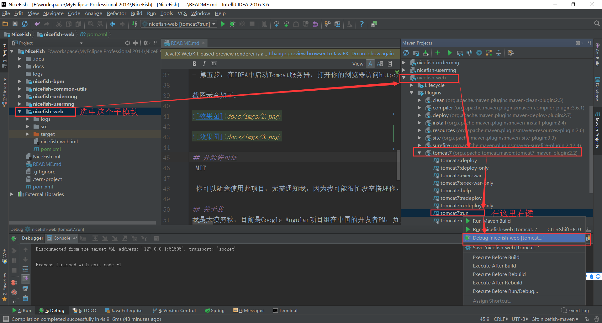
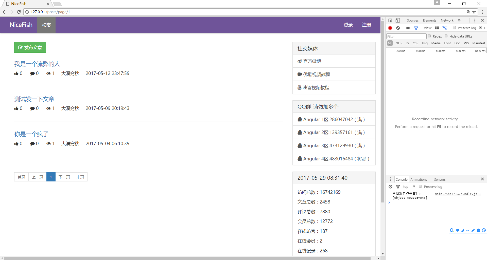

# NiceFish-SpringMybatis

NiceFish是一个系列教学项目，都是Angular这个技术栈。

- NiceFish：美人鱼，这是一个微型Blog系统，前端基于Angular 4.x + PrimeNG。http://git.oschina.net/mumu-osc/NiceFish/

- NiceFish-Admin：这是系统管理界面，基于Angular 4.x+PrimeNG，http://git.oschina.net/mumu-osc/NiceFish-Admin

- NiceFish-ionic：这是一个移动端的demo，基于ionic。http://git.oschina.net/mumu-osc/nicefish-ionic

- NiceFish-SpringMybatis：这是Java版后台服务，http://git.oschina.net/mumu-osc/NiceFish-SpringMybatis 

- NiceBlogElectron：https://github.com/damoqiongqiu/NiceBlogElectron ,这是一个基于Electron的桌面端项目，把NiceFish用Electron打包成了一个桌面端运行的程序。这是由ZTE中兴通讯的前端道友提供的，我fork了一个，有几个node模块的版本号老要改，如果您正在研究如何利用Electron开发桌面端应用，请参考这个项目。

## 对应的视频教程

此项目对应的视频教程（超清），包括所有PPT，请点这里：http://damoqiongqiu.github.io/videos/index.html

# 模块结构说明

前后端是完全分离开发的，此项目对应的前端代码位于NiceFish项目的nicefish分支上。请注意，是在http://git.oschina.net/mumu-osc/NiceFish/ 这个项目的nicefish分支上，与其它分支无关。

此项目采用的是maven的组织方式，开发工具使用的是IDEA。

- 最顶层的NiceFish项目，这是总的父项目，它什么也不做，只是一个空的容器，用来容纳所有子模块。
- nicefish-bpm，这个子模块未来用来实现bpm相关的业务；
- nicefish-common-utils，这个子模块用来放自己编写的一些工具类；
- nicefish-order，这个子模块未来用来实现订单相关的业务；
- nicefish-auth，这个子模块用来实现授权相关的业务，依赖于apache shiro框架；
- nicefish-web，这是web入口，它会被打成war包，它依赖于以上所有模块打出来的jar包。

# 使用方法

【注意】此项目需要JDK 8和Tomcat 8，如果你不知道如何配置IDEA和Maven的JDK版本，请查看这个链接http://blog.csdn.net/qq_37107280/article/details/73246274

- 第一步：克隆此项目的代码。
- 第二步：在IDEA中打开项目并配置好Tomcat，如果你不知道如何操作，请点击这个链接，里面有详细的步骤http://www.thinksaas.cn/topics/0/685/685545.html 。
- 第三步：建库，sql脚本在docs/sqls目录下，推荐使用最新版本的mysql或者MariaDB。
- 第四步：配置并启动nginx，把nginx的静态资源目录指向纯前端项目NiceFish的dist目录，如果您不知道如何配置，请参考docs目录下的nginx.conf文件。关于NiceFish纯前端项目的构建过程，请查看项目对应的README。再次强调，能与后端服务对接的代码位于NiceFish项目的nicefish分支上！https://gitee.com/mumu-osc/NiceFish
- 第五步：在IDEA中启动Tomcat服务器，打开你的浏览器访问http://127.0.0.1，就可以看到界面了。

截图示意如下：

## 在线交流QQ群

<a target="_blank" href="//shang.qq.com/wpa/qunwpa?idkey=8db5ed802cbddbf6432d7ba7dc4f2a316be020442491eb41cbfb1a12434e8cc7" class="list-group-item"><i class="fa fa-qq" aria-hidden="true"></i> Angular-1区-丝绸之路:286047042（满）</a>

<a target="_blank" href="//shang.qq.com/wpa/qunwpa?idkey=cbfcd79e7e90939b0e2c519f475fac4792985ce2abc5ad45ec5e06ffcfe944dd" class="list-group-item"><i class="fa fa-qq" aria-hidden="true"></i> Angular-2区-敦煌:139357161（满）</a>

<a target="_blank" href="//shang.qq.com/wpa/qunwpa?idkey=639229c8b6ad0c3a9a8f381dddf5d7785780b20d8c37eb25c91ac73ea7d37a5f" class="list-group-item"><i class="fa fa-qq" aria-hidden="true"></i> Angular-3区-玉门关:473129930（满）</a>

<a target="_blank" href="//shang.qq.com/wpa/qunwpa?idkey=12add102af3f67910bdc0de753dee10ebada08ab485af7e38f4dfa0ee27476f7" class="list-group-item"><i class="fa fa-qq" aria-hidden="true"></i> Angular-4区-河西走廊:483016484（满）</a>

<a target="_blank" href="//shang.qq.com/wpa/qunwpa?idkey=1293a6494fb306ea29d281e320a8f4ef82285fa5300f73118e6ff7a79ce76036"
class="list-group-item"><i class="fa fa-qq" aria-hidden="true"></i>
Angular-5区-楼兰:604253120（将满）
</a>

<a target="_blank" href="//shang.qq.com/wpa/qunwpa?idkey=fcd880ba919983dc85690642d48cf00ad0affd8d35de5f30542c895e622a8ab8"
class="list-group-item"><i class="fa fa-qq" aria-hidden="true"></i>
Angular-6区-凉州:124641447（将满）
</a>

<a target="_blank" href="//shang.qq.com/wpa/qunwpa?idkey=5d6b8c5296e4806142b8422ae7abca6f27b9b9b992a4dac80dc1392644e8970a"><i class="fa fa-qq" aria-hidden="true"></i>脚本娃娃-桃花岛-83163037（将满）</a>

如果您有Angular相关的问题需要讨论，或者单纯想跟我Say Hello，请加上面几个扣扣群。注意，我每天都会收到大量的求助消息，真的有点忙，所以请您优先在扣扣群里面讨论问题。

## 关于我

我是大漠穷秋，我的Github个人主页在这里：http://damoqiongqiu.github.io/ 。

## 开源许可证

 MIT
 
 你可以随意使用此项目，无需通知我，因为我可能很忙没空搭理你。
